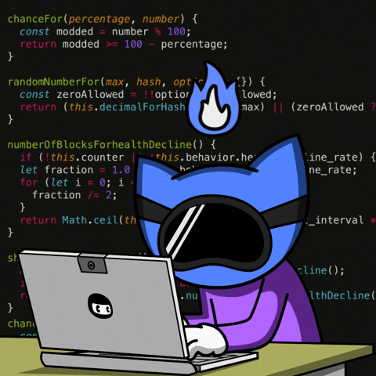

<h1 align="center">
    
</h1>

    

     <h4>Sou estudante de Análise e Desenvolvimento de Sistemas, focado em me tornar desenvolvedor front-end e full stack. No meu dia a dia, utilizo tecnologias como Figma, HTML5, CSS3, JavaScript, TypeScript, AngularJS, Bootstrap, Python, Java, Node.js, MySQL e SQLite para criar interfaces modernas, responsivas e funcionais, além de desenvolver soluções completas de software. Estou sempre em busca de aprimorar minhas competências e evoluir tanto no front-end quanto no back-end.
     </h4>    

## Siga-me nas redes! 🔗

  
  

## Tecnologias que eu uso no meu dia:

Atualmente tenho conhecimento nas seguintes áreas da tecnologia:
| Linguagens de Programação | Desenvolvimento Web | Banco de Dados | Outros |
| ------ | ------ | ------ | ------ |
|  |  |  | 

# IDE
Atualmente tenho conhecimento das seguintes IDEs: 

## 📌 Projetos Acadêmicos

### 🚀 TRAVELRJ – Website de Turismo

**📝 Descrição:**  
Plataforma informativa voltada a turistas no Rio de Janeiro, com foco em acessibilidade para falantes de inglês e espanhol. Inclui funcionalidades como reservas de hospedagens, compras de produtos e serviços locais.

**🎯 Missão:**  
Criar uma solução digital que facilite o turismo no RJ, promovendo a inclusão linguística e o acesso rápido a informações relevantes para visitantes estrangeiros.

---

### 🦸 Interface de App sobre Diabetes (Figma)

**📝 Descrição:**  
Projeto de interface desenvolvido no Figma para um aplicativo voltado à prevenção e cuidados com a diabetes. O design é inspirado nos personagens dos Vingadores, com foco em usabilidade e apelo visual para diferentes perfis de usuários.

**🎯 Missão:**  
Projetar uma interface funcional, atrativa e educativa que auxilie usuários no controle da diabetes e promova o autocuidado de forma acessível.

---

### 📚 Sistema de Vendas para Livraria

**📝 Descrição:**  
Sistema de gerenciamento de vendas e estoque de livros. Suporta múltiplos autores por livro, relacionamento com editoras, cadastro completo e visualização de sinopses em dispositivos móveis e desktop.

**🎯 Missão:**  
Automatizar e otimizar o processo de vendas em livrarias, garantindo controle eficiente de estoque e boa experiência ao usuário.

---

